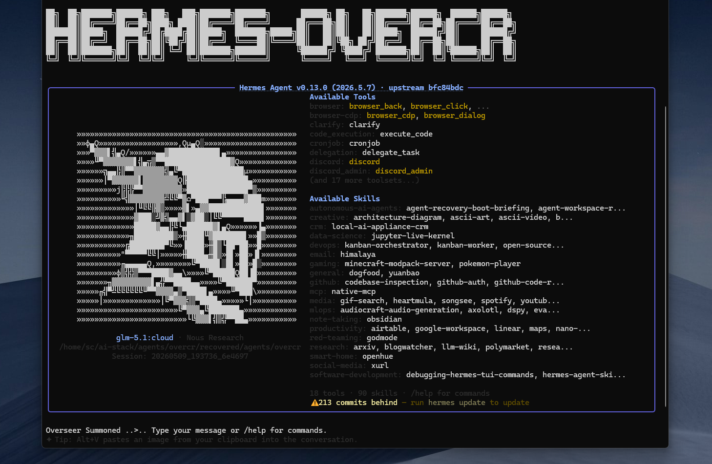

# OverCR 
(v1.0.0 — Stabilized Substrate)



---

OverCR (Operational Vigilance, Execution, Recovery, Command & Routing) is a **Hermes-first portable AI orchestration substrate**.

It is not a chatbot, a SaaS wrapper, or a vertical product. It is the governed operating layer that AI workloads run inside.

OverCR provides identity, doctrine, boot continuity, filesystem-first state, subagent routing, packet validation, workflow choreography, audit trails, and approval-aware operational structure. Hermes Agent is the **reference execution runtime**.

This is the **clean-core release**: deployment-agnostic, free of live-test contamination, personal operational context, and project-specific assumptions. It contains everything needed to cold-start an OverCR instance from zero.

## What OverCR Provides

| Capability | Purpose |
|---|---|
| Filesystem-first continuity | Canonical state lives on disk, not in chat history |
| Governed subagents | Specialist workers operate through typed packets and approval gates |
| L1-L6 validation | Model and worker output is untrusted until sanitized and validated |
| Workflow choreography | Bounded, auditable DAGs route work across subagents through OverCR |
| Runtime portability | Hermes is the reference runtime; other runtimes may implement the host contract |
| Recovery discipline | Cold starts, replays, and freezes are designed into the substrate |

## Core Guarantees

- **Filesystem truth is authoritative.** Chat history is ephemeral; filesystem state is canonical.
- **Model output is untrusted.** Outputs must be sanitized and validated before state advancement.
- **OverCR is sovereign.** Subagents never route directly to each other.
- **No autonomous outbound contact.** External contact requires explicit operator approval.
- **No autonomous filesystem mutation.** CodER and PypER produce plans, not unsupervised host actions.
- **Hermes-first, runtime-agnostic.** Hermes is the validated reference runtime; compatibility with other runtimes is possible but not guaranteed.

## What This Is Not

- Not a live workspace snapshot (that's `overcr-live-workspace`)
- Not a test artifact archive (that's `overcr-test-artifacts`)
- Not a frozen release backup (that's `overcr-release-archive`)
- Not specific to any business, region, or client

## Directory Structure

```
overcr-core/
  README.md                              # This file
  soul.md                                # Identity, personality, rules, workflow
  soul_reference.md                      # Integrity-check copy of soul.md
  boot.sh                                # Cold-start boot script
  prompts/
    hq_compact_boot.md                   # Boot prompt template
  configs/
    cag-memory-config.json.tpl           # CAG integration schema (template)
    session-ingestion-config.json.tpl    # Session ingestion schema (template)
    release-preservation-config.txt.tpl  # Archive policy (template)
  skeleton/
    memory/routes/hq/.gitkeep            # Directory scaffold
    workspace/.gitkeep
    logs/.gitkeep
    tasks/.gitkeep
    tui/.gitkeep
```

## Quick Start

1. Copy `overcr-core/` to your desired location (e.g., `$HOME/overcr-core`)
2. Copy `skeleton/` contents into the root (flatten the scaffold):
   ```bash
   cp -r skeleton/* .
   ```
3. Fill in config templates:
   ```bash
   # Replace {{PLACEHOLDER}} values with your deployment paths
   sed -i 's|{{OVERCR_ROOT}}|/your/path/to/overcr|g' configs/*.tpl
   sed -i 's|{{HERMES_HOME}}|/home/you/.hermes|g' configs/*.tpl
   sed -i 's|{{CAG_MEMORY_PATH}}|/your/cag/path|g' configs/*.tpl
   sed -i 's|{{ROUTE_ID}}|your-route-id|g' configs/*.tpl
   sed -i 's|{{ARCHIVE_ROOT}}|/your/release/archive/path|g' configs/*.tpl
   # Remove .tpl extension after filling
   for f in configs/*.tpl; do mv "$f" "${f%.tpl}"; done
   ```
4. Run boot:
   ```bash
   ./boot.sh
   ```
5. Launch Hermes with the printed command.

## Config Template Variables

| Variable | Description | Example |
|----------|-------------|---------|
| `{{OVERCR_ROOT}}` | Absolute path to OverCR workspace | `$HOME/overcr-core` |
| `{{HERMES_HOME}}` | Absolute path to Hermes config directory | `$HOME/.hermes` |
| `{{HERMES_STATE_DB}}` | Absolute path to Hermes SQLite state DB | `$HOME/.hermes/state.db` |
| `{{HERMES_HISTORY_PATH}}` | Absolute path to Hermes history file | `$HOME/.hermes/.hermes_history` |
| `{{CAG_MEMORY_PATH}}` | Absolute path to CAG memory store | `$HOME/overcr-cag-memory` |
| `{{ROUTE_ID}}` | Route identifier for this HQ instance | `overcr-hq` |
| `{{ARCHIVE_ROOT}}` | Absolute path to release archive directory | `$HOME/overcr-releases` |

## Architecture Principles

1. **Filesystem truth is authoritative.** Chat history is ephemeral; filesystem state is canonical.
2. **Inspect before acting.** Always read state before modifying it.
3. **Prefer reversible changes.** Destructive operations require explicit approval.
4. **Keep work inside the assigned workspace.** Sandbox all operations.
5. **Cold-start continuity.** Any new instance must be able to boot from filesystem state alone — no chat dependency.
6. **Release discipline.** Frozen release artifacts are immutable. Live state evolves independently. Never overwrite a release archive.
7. **Runtime-agnostic but Hermes-first.** Other runtimes may implement the host runtime contract, but Hermes is the only tested reference implementation. Compatibility is not guaranteed.

## Safety & Governance

- **Filesystem-first source of truth.** All canonical state lives on disk. Chat history is ephemeral.
- **Model output is untrusted until sanitized and validated.** All subagent output passes 6-level validation before any state advancement.
- **No autonomous outbound contact.** OverCR has no network stack; any outbound action requires explicit operator approval.
- **No autonomous filesystem mutation.** Workers produce packets; they do not write files, open sockets, or modify state directly.
- **Open WebUI is an optional secondary visual layer.** Hermes is the reference execution runtime; other runtimes are possible but compatibility is not guaranteed.
- **PypER and CodER are advisory only.** Their outputs are execution plans and patch plans, not autonomous actions. All plans require operator approval before any host action.
- **Workflow choreography is bounded, audited, and approval-aware.** Every workflow DAG is pre-flight checked by policy, produces append-only audit traces, and respects approval gates.

## Governance Model

- **soul.md** is the supreme identity document. All operational behavior derives from it.
- **soul_reference.md** is the integrity check copy. If it diverges from soul.md, something is wrong.
- **overcr_state.json** (generated at runtime, not in core) tracks live instance state.
- **HQ_BOOT_MANIFEST.md** and **HQ_ROUTE_MARKER** (generated at runtime) declare the active instance.

## What Gets Generated at Runtime

After booting from this core, the live workspace will generate:

- `overcr_state.json` — instance ID, boot timestamp, runtime config, route declarations
- `HQ_BOOT_MANIFEST.md` — instance boot record
- `HQ_ROUTE_MARKER` — session route declaration
- `HQ_BOOT_VERIFICATION.txt` — integrity check script
- `prompts/hq_boot_context_bundle.txt` — generated boot briefing
- `prompts/hq_raw_boot_context.txt` — raw boot instructions
- `sessions/hq/` — session logs

These files are live operational state, not part of the core release.

## Version History

| Version | Date | Type | Notes |
|---------|------|------|-------|
| v0.0.3 | 2026-05-09 | Clean Core | First clean-core package, purged workload contamination |
| v0.0.4 | 2026-05-09 | Subagents | Added CryER, PypER, CodER, KnowER doctrine and handoff schemas |
| v0.0.5 | 2026-05-09 | Orchestration | Task lifecycle, packet lifecycle, validation rules |
| v0.1.0 | 2026-05-10 | Runtime | Filesystem task runtime, approval gates, audit trail |
| v0.2.0 | 2026-05-10 | Workers | First live worker bridge: CodER subprocess |
| v0.2.1 | 2026-05-10 | Routing | Model routing policy, worker registry, health checks |
| v0.2.2 | 2026-05-10 | Cleanup | Canonical root/path cleanup with `$OVERCR_ROOT` |
| v0.2.3 | 2026-05-10 | Testing | Consolidated regression suite via `tests/run_all.py` |
| v0.2.4 | 2026-05-10 | Packaging | GitHub-ready repo hygiene, install docs, release scripts |
| v0.3.0 | 2026-05-10 | KnowER | KnowER promoted to first-class live worker |
| v0.4.0 | 2026-05-10 | CryER | CryER worker promoted for public-signal recon over provided inputs |
| v0.4.1 | 2026-05-10 | Inference | KnowER inference governance with mock adapter |
| v0.4.2 | 2026-05-10 | Adapter | Hermes CLI adapter infrastructure |
| v0.4.3 | 2026-05-10 | Live Inference | Real Hermes model output sanitized into validated KnowER packet |
| v0.5.0 | 2026-05-10 | CryER Inference | CryER live-inference-capable path and governance |
| v0.6.0 | 2026-05-10 | CodER Inference | Advisory patch-plan inference, no mutation |
| v0.7.0 | 2026-05-10 | PypER Planning | Execution planning packets, no autonomous execution |
| v0.8.0 | 2026-05-10 | Workflows | Governed cross-worker workflow choreography |
| v0.9.0-rc1 | 2026-05-11 | Release Candidate | Threat model, security review, RC gates |
| v1.0.0 | 2026-05-11 | Stable | Hermes-first portable orchestration substrate |

## License

Internal use. Not for redistribution without authorization.